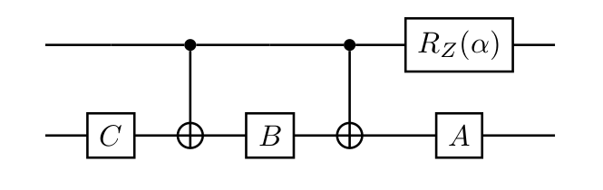
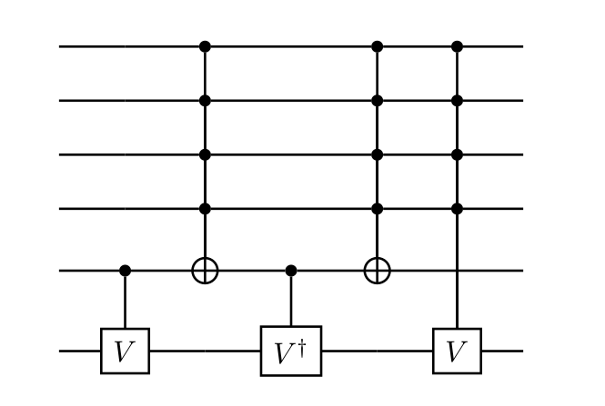

# Introduction to quantum computing : Implementation of the ABC decomposition and the Sleathor-Whitney reduction

This is a school-project that aims to implement the ABC decomposition 
and the Sleathor-Whitney reduction

## ABC decomposition

The ABC decomposition states that any 1 qubits gate can be decomposed as such:

$$
U = e^{ia}AXBXC
$$

This can also be written as:

$$
U  = e^{ia}R_z(\theta_2)R_y(\theta_1)R_z(\theta_0)
$$

where 

$$
A  = R_y(\frac{\pi}{2}) ;
B  = R_y(\frac{-\pi}{2})R_z(\frac{-\pi}{2}) ;
C  = R_z(\frac{\pi}{2})
$$

The first part of this projet was to find the rotation angles for the X gate.
Then we add to build the quantum circuit that implements the ABC decomposition,
to prove that the decomposition is correct.

## Sleathor-Whitney reduction

The Sleathor-Whitney reduction states that any controlled unitary gate can 
be written, using only CNOT gates and V. (V being an unitary gate that is the square of U.)

We implemented it with 2 qubits, and 3 qubits, then tried to generalize it to n qubits.

We add to implement the controlled CNOT to do so, using the fact that the CNOT
gate can be built from the X gate and expended.

Indeed, the CNOT gate can be written as a block matrix where X is located on 
the bottom right corner and the identity matrix are located on the top left.
From there, the controlled CNOT can be implemented by using CNOT gates and 
expanding the matrix.

